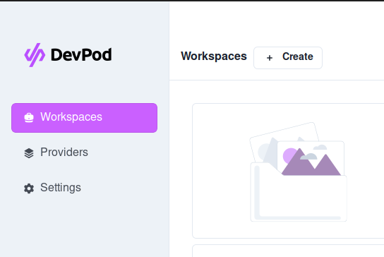
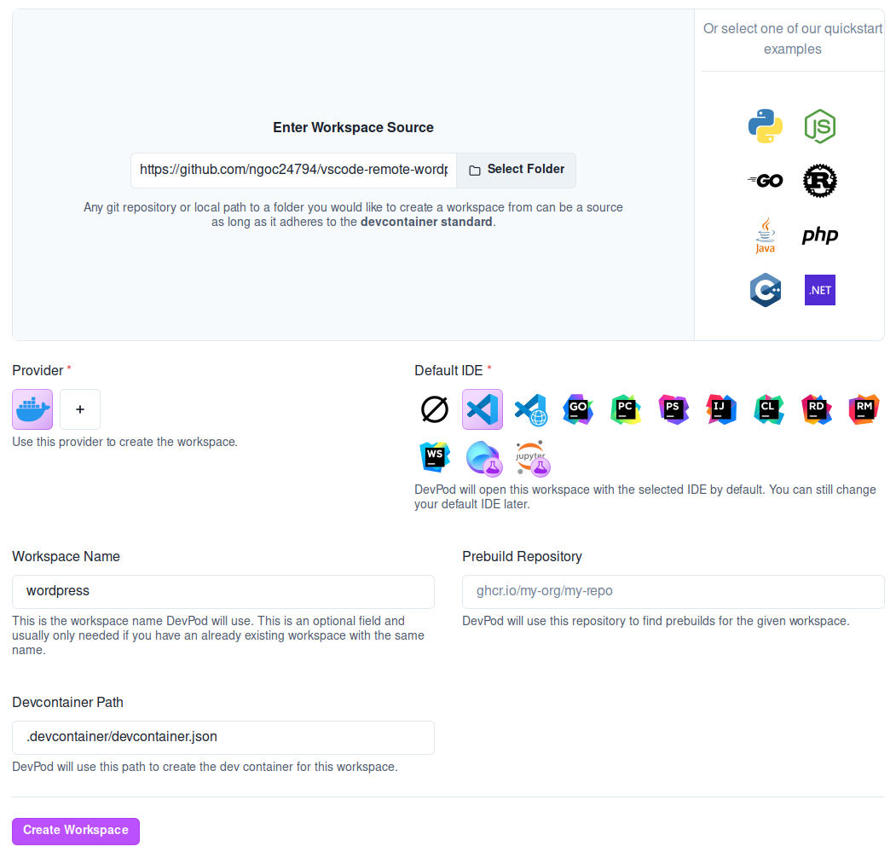

# VSCode Remote Wordpress Development

This project template allows you to quickly initialize a Wordpress project using Docker compose, [Dev Container Extension](https://marketplace.visualstudio.com/items?itemName=ms-vscode-remote.remote-containers) and [DevPod](https://devpod.sh/).

## Prerequisites

- Git
- Docker compose
- Visual Studio Code has [Dev Container Extension](https://marketplace.visualstudio.com/items?itemName=ms-vscode-remote.remote-containers) installed.
- [DevPod](https://devpod.sh/)

## Usage

This project will use 3 docker containers including:

- Nginx (image: nginx:alpine, expose port: 8000)
- Wordpress (image: wordpress:php8.2-fpm)
- Mysql database (image: mysql:8.0.27, expose port: 3306)

Open DevPod and click `Create` button to create new workspace.

Enter workspace source is `https://github.com/ngoc24794/vscode-remote-wordpress-dev.git` and your workspace info then click `Create workspace` button.

If successful then you will see 3 containers running. Open a browser and go to the address: `http://<host-ip>:8000` you will see Wordpress running.

You can change the value of environment variables in `docker-compose.yml` file.

## Debug

To debug the application, you open the `<project-name>` folder with Visual Studio Code. Set a break point and press the F5 key to launch `Listen for XDebug`. Refresh the browser and you will see Visual Studio Code stop the break point.

## License

MIT

**Free Software, Hell Yeah!**
